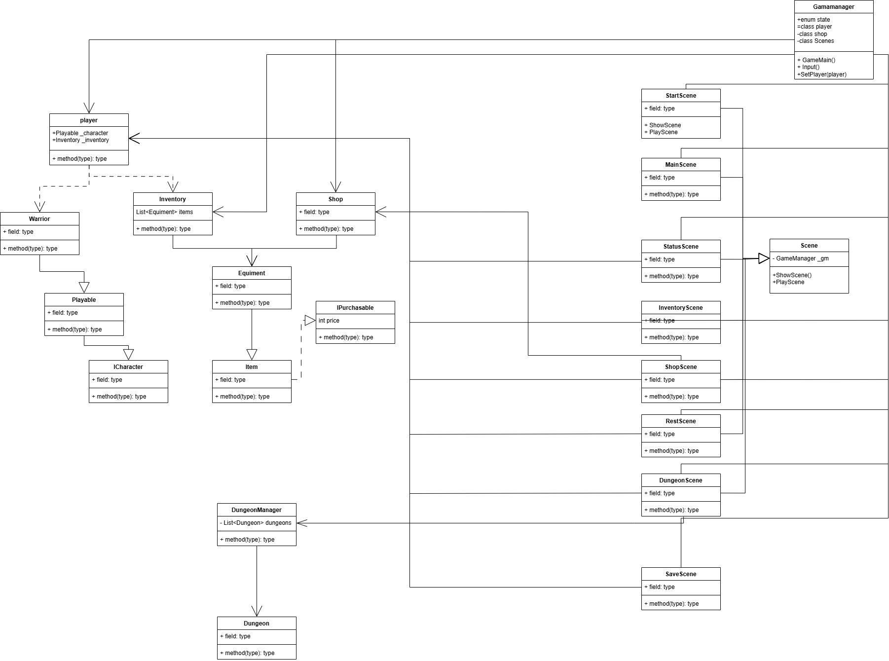

# TextRPG
내일배움캠프 2주차 - 개인과제  
Text RPG 입니다.

## 게임 화면
.gif)

## 구현
{: Width="300" Height="200"}  
- GameManager
    - 게임의 시스템을 총괄하는 오브젝트
- Scens
    - 시작화면, 메인화면, 상태보기 등등 각각의 씬들을 표시하고, 사용자와 상호작용하는 부분
- Player
    - 사용자의 캐릭터와 inventory를 관리
- playable
    - 사용자가 플레이할 수 있는 캐릭터를 관리
    - Warrior로 구현됨
- Inventory 
    - 사용자가 소지한 아이템을 관리
- Item
    - 아이템을 관리
    - Equipment로 구현됨
- shop
    - 아이템을 구매 할 수 있는 목록을 관리.